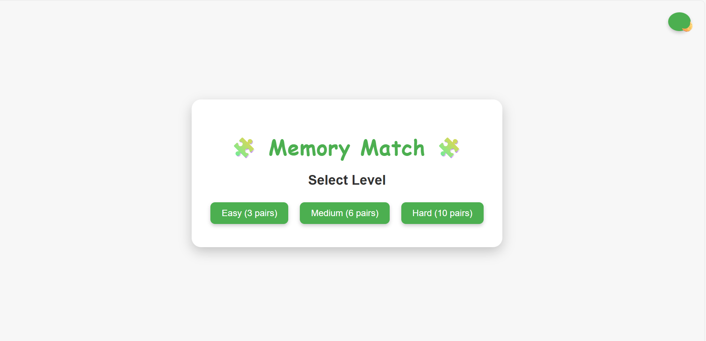
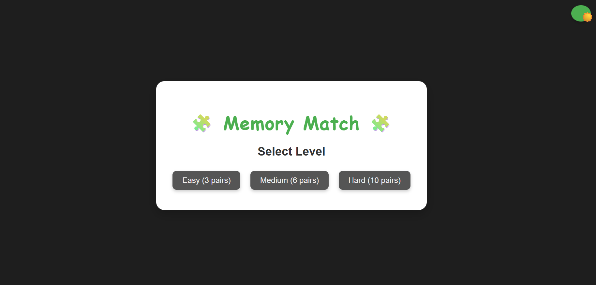
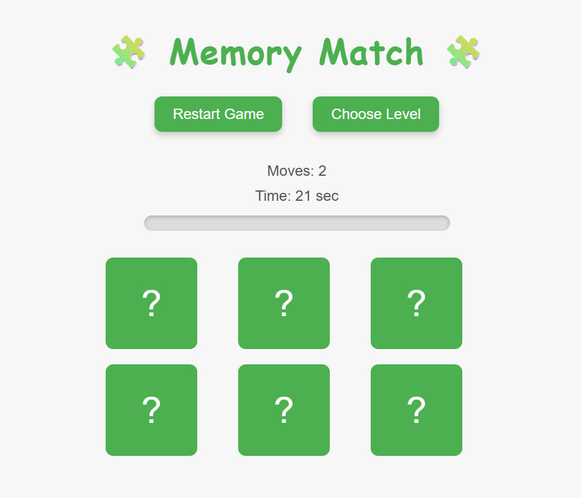
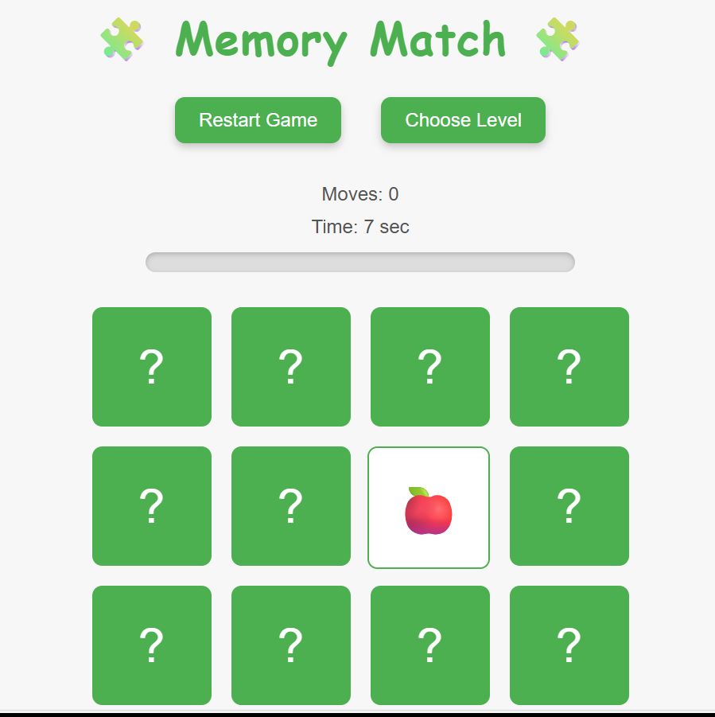
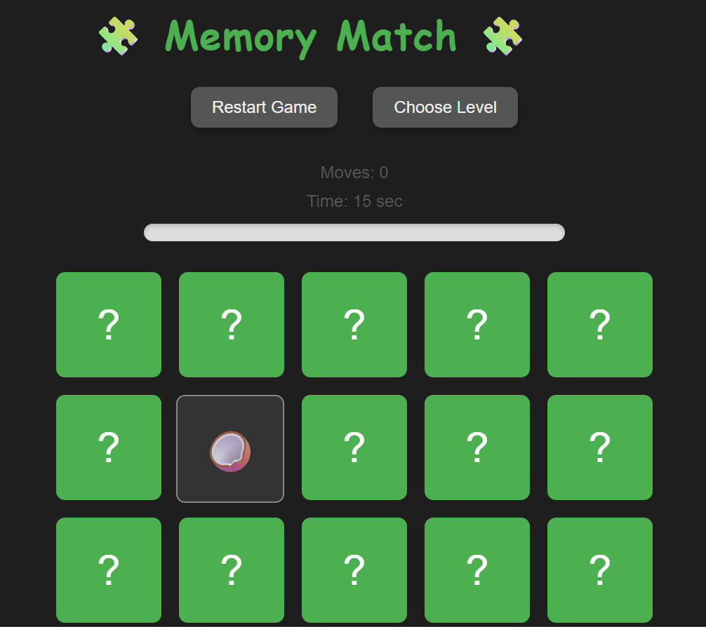
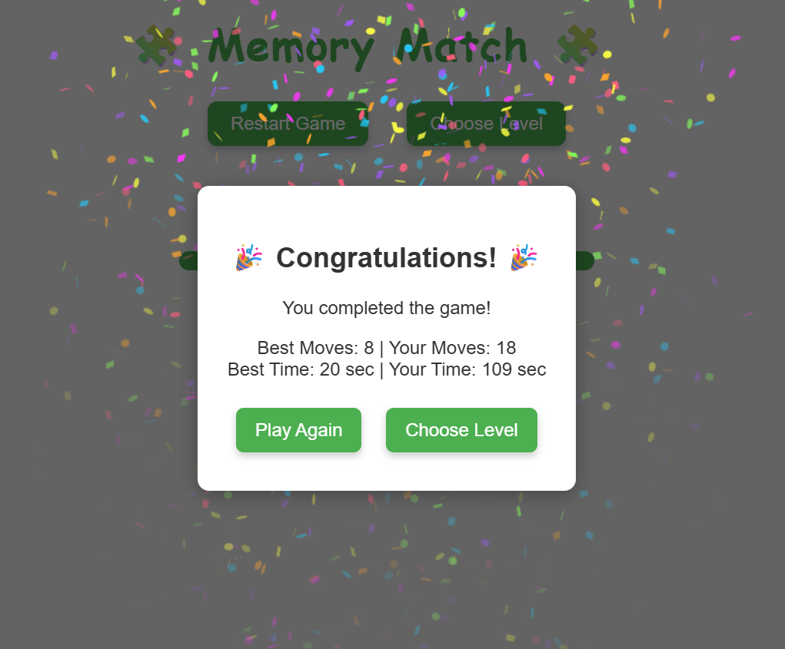

# 🧩 Memory Match Game

A simple, interactive memory card game built using **HTML**, **CSS**, and **JavaScript**. Challenge yourself to match all card pairs while tracking time, moves, and progress.

## 🎮 Features
- 🃏 **3 Difficulty Levels** (Easy, Medium, Hard)
- 🕹️ **Card Flip Animations**
- ⏱️ **Timer & Move Counter**
- 📊 **Progress Bar**
- 🎉 **Victory Confetti**
- 🌙 **Day/Night Theme Toggle**
- 🎵 **Sound Effects**
- 📱 **Responsive Design**

## 📷 Game Preview

Here are some screenshots of the Memory Match Game in action:









## 🚀 How to Play
1. Select a level.
2. Flip cards to find matching pairs.
3. Match all pairs to win!

## 💻 Technologies Used
- HTML5  
- CSS3  
- Vanilla JavaScript

## 📌 Planned Features
- Emoji Theme Options (animals, shapes)
- Card Shuffle Animation
- Touch Gestures

## 📥 Run Locally

```bash
git clone https://github.com/archita06sharma/memory-game.git
cd memory-game
```
Then, open the index.html file directly in your browser.

## 🌟 Show Some Love
If you like the project, give it a ⭐️ star!

## 👩‍💻 Developed By
Archita Sharma

